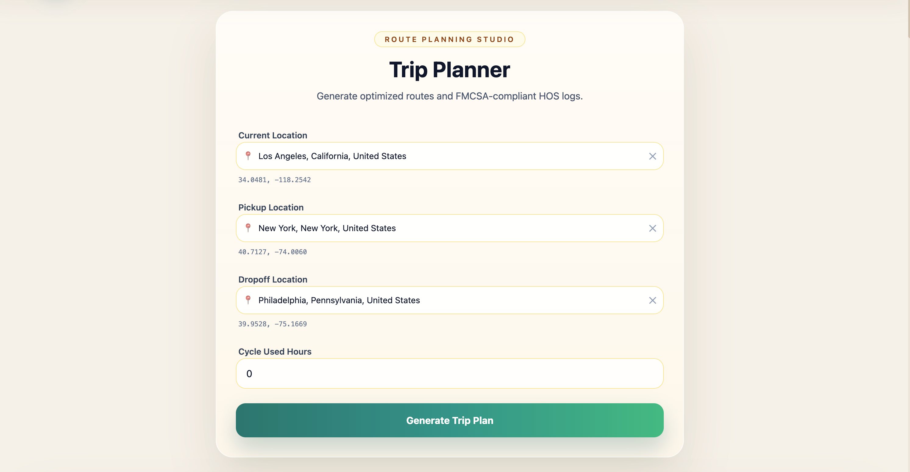
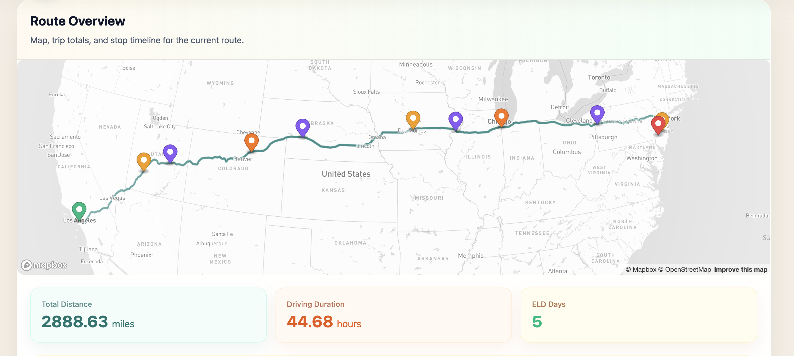
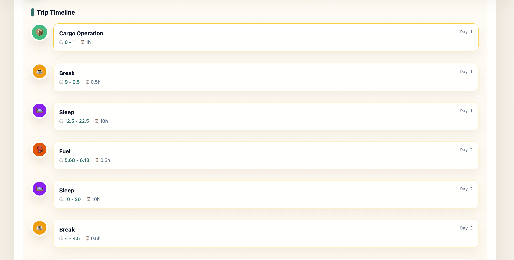
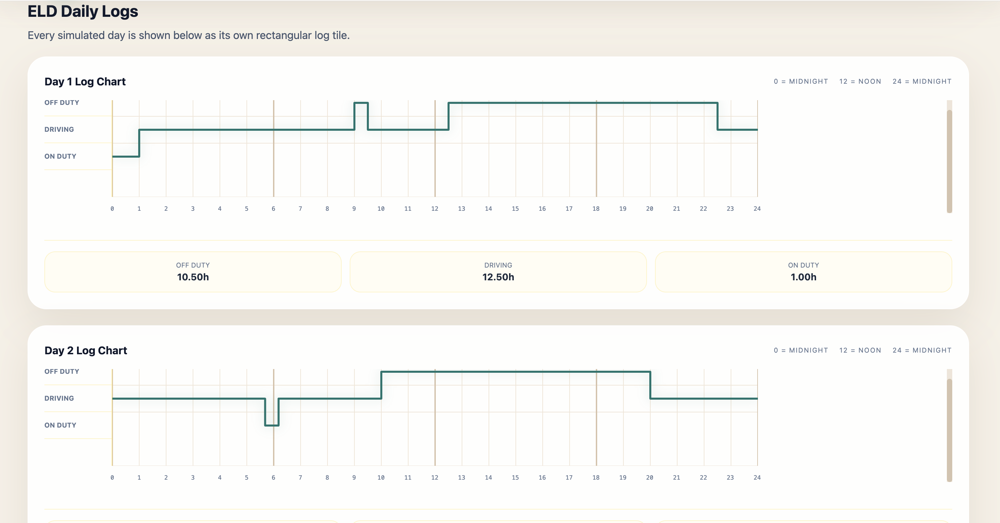

# Spotter Labs Trip Planner

Full-stack trip planning app with a React frontend and a Django REST backend.

The app lets a user:
- search for current, pickup, and dropoff locations with Mapbox geocoding
- send a trip-planning request to the backend
- generate a driving route from Mapbox Directions
- simulate FMCSA-style Hours of Service (HOS) / ELD logs
- render the route, stop timeline, and daily ELD charts in a single-page UI

## Screenshots






## Project Structure

```text
spotter-labs/
├── backend/   # Django + DRF API
├── frontend/  # React + Vite client
└── README.md  # global project documentation
```

## Architecture

### Frontend

Stack:
- React 19
- Vite
- Tailwind CSS v4
- Axios
- Mapbox GL JS

Frontend responsibilities:
- collect trip inputs
- call the backend API
- render the route map
- show trip stops
- render ELD logs day by day

Key files:
- [frontend/src/App.jsx](/Users/dev/Desktop/spotter-labs/frontend/src/App.jsx)
- [frontend/src/pages/Home.jsx](/Users/dev/Desktop/spotter-labs/frontend/src/pages/Home.jsx)
- [frontend/src/components/LocationAutocomplete.jsx](/Users/dev/Desktop/spotter-labs/frontend/src/components/LocationAutocomplete.jsx)
- [frontend/src/components/Map.jsx](/Users/dev/Desktop/spotter-labs/frontend/src/components/Map.jsx)
- [frontend/src/components/Timeline.jsx](/Users/dev/Desktop/spotter-labs/frontend/src/components/Timeline.jsx)
- [frontend/src/components/ELDLog.jsx](/Users/dev/Desktop/spotter-labs/frontend/src/components/ELDLog.jsx)
- [frontend/src/services/api.js](/Users/dev/Desktop/spotter-labs/frontend/src/services/api.js)

### Backend

Stack:
- Django 6
- Django REST Framework
- drf-spectacular
- requests
- python-decouple

Backend responsibilities:
- validate trip request payloads
- convert location objects into Mapbox coordinate strings
- call Mapbox Directions API
- simulate HOS / ELD events
- derive trip stop summaries from those events

Key files:
- [backend/core/settings.py](/Users/dev/Desktop/spotter-labs/backend/core/settings.py)
- [backend/core/urls.py](/Users/dev/Desktop/spotter-labs/backend/core/urls.py)
- [backend/trips/serializers.py](/Users/dev/Desktop/spotter-labs/backend/trips/serializers.py)
- [backend/trips/views.py](/Users/dev/Desktop/spotter-labs/backend/trips/views.py)
- [backend/trips/services/mapbox_service.py](/Users/dev/Desktop/spotter-labs/backend/trips/services/mapbox_service.py)
- [backend/trips/services/hos_service.py](/Users/dev/Desktop/spotter-labs/backend/trips/services/hos_service.py)
- [backend/trips/tests.py](/Users/dev/Desktop/spotter-labs/backend/trips/tests.py)

### Persistence Model

This backend is currently stateless for trip planning:
- no Django models are used
- no application data is persisted for trips
- SQLite exists only as the default Django database configuration

## API Overview

Base backend URL in local development:

```text
http://127.0.0.1:8000
```

Available API routes:
- `POST /api/plan-trip/`
- `GET /api/schema/`
- `GET /api/docs/`

### `POST /api/plan-trip/`

Accepts 3 nested location objects plus cycle hours.

Request body:

```json
{
  "current_location": {
    "name": "New York",
    "full_address": "New York, New York, United States",
    "lat": 40.712749,
    "lng": -74.005994,
    "place_id": "place.233720044"
  },
  "pickup_location": {
    "name": "Philadelphia",
    "full_address": "Philadelphia, Pennsylvania, United States",
    "lat": 39.952724,
    "lng": -75.163526,
    "place_id": "place.pickup"
  },
  "dropoff_location": {
    "name": "Baltimore",
    "full_address": "Baltimore, Maryland, United States",
    "lat": 39.290882,
    "lng": -76.610759,
    "place_id": "place.dropoff"
  },
  "cycle_used_hours": 12.5
}
```

Validation rules:
- `lat` must be between `-90` and `90`
- `lng` must be between `-180` and `180`
- `cycle_used_hours` must be between `0` and `70`

Important Mapbox note:
- the frontend stores `lat` and `lng` separately
- the backend sends Mapbox `lng,lat`
- example: `-74.005994,40.712749`

Example success response:

```json
{
  "route": {
    "distance_miles": 190.5,
    "duration_hours": 3.75,
    "geometry_polyline": "..."
  },
  "stops": [
    {
      "sequence": 1,
      "type": "Cargo Operation",
      "day": 1,
      "start_hour": 0.0,
      "end_hour": 1.0,
      "duration_hours": 1.0,
      "route_progress": 0.0
    }
  ],
  "logs": [
    {
      "day": 1,
      "events": [
        {
          "status": "ON_DUTY",
          "start_hour": 0.0,
          "end_hour": 1.0
        }
      ]
    }
  ]
}
```

Error patterns:
- `400 Bad Request` for serializer validation failures
- `424 Failed Dependency` for Mapbox request failures
- `500 Internal Server Error` for unexpected backend exceptions

## Frontend to Backend Workflow

### 1. User selects locations

The frontend location autocomplete calls Mapbox Geocoding and normalizes each selected feature to:

```json
{
  "name": "New York",
  "full_address": "New York, New York, United States",
  "lat": 40.712749,
  "lng": -74.005994,
  "place_id": "place.233720044"
}
```

### 2. Frontend submits trip data

[frontend/src/services/api.js](/Users/dev/Desktop/spotter-labs/frontend/src/services/api.js) posts the payload to:

```text
/api/plan-trip/
```

### 3. Backend validates payload

[backend/trips/serializers.py](/Users/dev/Desktop/spotter-labs/backend/trips/serializers.py) validates:
- nested location objects
- coordinate ranges
- cycle hours range

### 4. Backend calls Mapbox Directions

[backend/trips/views.py](/Users/dev/Desktop/spotter-labs/backend/trips/views.py) converts each location to `lng,lat` format and sends:

```text
current;pickup;dropoff
```

to the Mapbox Directions service.

### 5. Backend simulates HOS logs

[backend/trips/services/hos_service.py](/Users/dev/Desktop/spotter-labs/backend/trips/services/hos_service.py) creates:
- driving events
- breaks
- fuel stops
- sleep / reset periods
- cargo operation windows

Then it groups the events into daily ELD log slices.

### 6. Backend derives trip stops

From the simulated events, the backend creates stop records with:
- type
- day
- time window
- duration
- `route_progress`

`route_progress` is later used by the frontend to place approximate stop markers on the map.

### 7. Frontend renders results

The single-page UI shows:
- route map
- start / end / stop markers
- trip summary cards
- stop timeline
- one ELD chart tile per day

### Frontend rendering details

Map rendering:
- `frontend/src/components/Map.jsx` initializes one Mapbox map instance
- the backend returns `route.geometry_polyline`
- the frontend decodes that polyline with `@mapbox/polyline`
- decoded points are converted from `[lat, lon]` into `[lon, lat]` before plotting
- the route is drawn as a GeoJSON `LineString`
- the map fits bounds around the full route automatically

Stop markers:
- the backend returns `route_progress` for each stop, not exact stop GPS coordinates
- the frontend uses that progress value to interpolate an approximate marker position along the route geometry
- start and end markers are always placed at the first and last route coordinates

Timeline rendering:
- `frontend/src/components/Timeline.jsx` renders one card per backend stop
- each card shows stop type, trip day, time window, and duration
- the timeline is a UI projection of backend stop order; it does not derive stop types itself

ELD rendering:
- `frontend/src/components/ELDLog.jsx` renders one tile per `logs` item returned by the backend
- each day uses the backend `events` array directly
- the chart maps event hours to X positions and status rows to Y positions
- a single SVG polyline is built from those segments to draw the ELD trace
- totals per status are calculated per day on the frontend for display only

## Local Development

### Backend setup

```bash
cd backend
python -m venv .venv
source .venv/bin/activate
pip install -r requirements.txt
```

Create `.env` in `backend/` with at least:

```env
SECRET_KEY=your-django-secret
DEBUG=True
MAPBOX_ACCESS_TOKEN=your_mapbox_token
```

Important:
- use `DEBUG=True` or `DEBUG=False`
- do not use non-boolean values like `DEBUG=release`, because `python-decouple` casts this setting to a boolean

Run backend:

```bash
cd backend
.venv/bin/python manage.py runserver
```

Backend docs:
- `http://127.0.0.1:8000/api/docs/`

### Frontend setup

```bash
cd frontend
npm install
```

Create frontend env values as needed:

```env
VITE_API_BASE_URL=http://127.0.0.1:8000/api
VITE_MAPBOX_ACCESS_TOKEN=your_mapbox_token
```

Run frontend:

```bash
cd frontend
npm run dev
```

Common scripts:

```bash
npm run dev
npm run build
npm run lint
npm run preview
```

## Testing and Verification

Backend tests:

```bash
cd backend
env DEBUG=False .venv/bin/python manage.py test trips
```

Current backend tests cover:
- `lng,lat` coordinate transformation for Mapbox
- coordinate validation
- stop derivation across multiple days

Frontend verification:
- no dedicated automated frontend test suite is set up yet
- lint/build should be the first verification pass

## Current Behavior Notes

- The frontend is intentionally a single-page flow.
- Stop markers on the map are approximate placements along the route, based on simulated driving progress rather than exact GPS stop coordinates.
- The backend does not store trips in a database.
- CORS is fully open in development via `CORS_ALLOW_ALL_ORIGINS = True`.

## Suggested Team Workflow

### When changing the frontend

1. Update the UI component.
2. Check the API payload contract still matches the backend serializer.
3. Verify map rendering, timeline, and ELD log output together.
4. Run `npm run lint` and `npm run build` when local Node is healthy.

### When changing the backend

1. Update serializer or service logic.
2. Keep the `POST /api/plan-trip/` contract stable unless coordinated with the frontend.
3. Add or update tests in `backend/trips/tests.py`.
4. Run:

```bash
env DEBUG=False .venv/bin/python manage.py test trips
```

### When changing the API contract

1. Update serializer definitions.
2. Update frontend request construction.
3. Update frontend rendering assumptions.
4. Update this README with the new request/response shape.

## Known Environment Issue

Frontend build verification may fail on machines where the local `node` binary is linked against a missing ICU library. If that happens, fix the local Node installation before relying on build output.
